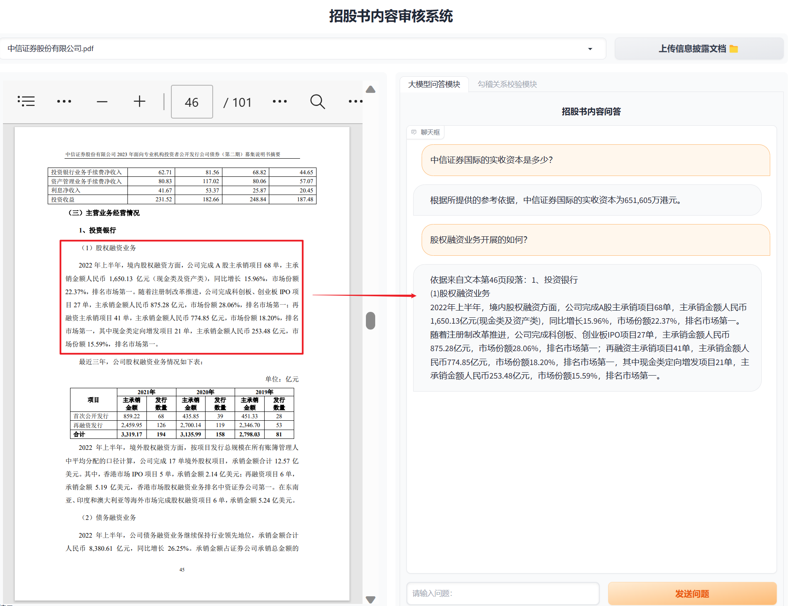
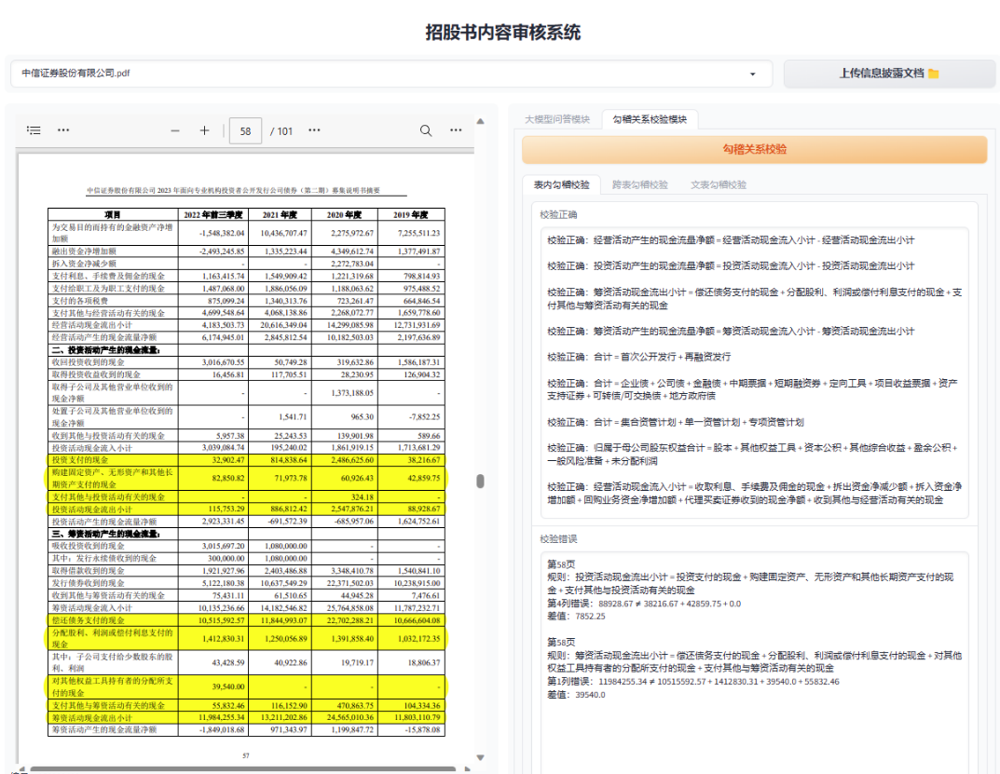

# ChatWithDoc
- 以大语言模型ChatGLM-6B为基座，接入文档阅读功能进行实时问答，可上传txt/docx/pdf多种文件类型。
- 对于信息披露文档，接入金融勾稽校验功能，便于财务审核。
### 文档智能问答模块
- 支持较少页数的文档理解
- 支持问题的定位
- 支持多轮交互问答
- 支持txt / docx / pdf多种文件类型的输入
- 可在聊天过程中自由切换文档，切换后延续本篇文档的对话历史
- PDF文档问答中加入参考依据（不稳定）

### 财务勾稽关系审核模块
- 支持对表内勾稽、跨表勾稽、文表勾稽三种校验
- 支持对勾稽关系错误定位



## 复现准备
- 配置环境
```
pip install -r requirements.txt
```

- 开启PDF显示服务

由于gradio的HTML模块不支持文档内容显示，所以只能自己开一个PDF显示的端口，然后用`<iframe>`进行包裹显示。
默认端口8081，可在`config.yaml`中调整。
```
python show_pdf.py
```
- 开启大模型服务。

本项目使用开源大模型
[ChatGLM-6B](https://github.com/THUDM/ChatGLM-6B)
，在运行时需要开启ChatGLM-6b的api。
默认端口号为8000。请预先部署该模型后方可运行程序
```
python api.py
```

- 最后，开启招股书内容审核页面
```
python demo_pro.py
```

[//]: # (### API部署)

[//]: # (运行)

[//]: # (```)

[//]: # (python api.py)

[//]: # (```)

[//]: # ()
[//]: # (请求)

[//]: # (```)

[//]: # (file_path = "reference_file.pdf")

[//]: # (data = {"prompt": "这篇文章主要讲了什么？", "history": []})

[//]: # (multipart_data = {)

[//]: # (    'json': &#40;None, json.dumps&#40;data&#41;, 'application/json'&#41;,)

[//]: # (    'file': &#40;open&#40;file_path, 'rb'&#41;&#41;)

[//]: # (})

[//]: # (response = requests.post&#40;url, files=multipart_data&#41;)

[//]: # (```)

[//]: # ()
[//]: # (得到返回值)

[//]: # (```)

[//]: # ()
[//]: # (```)