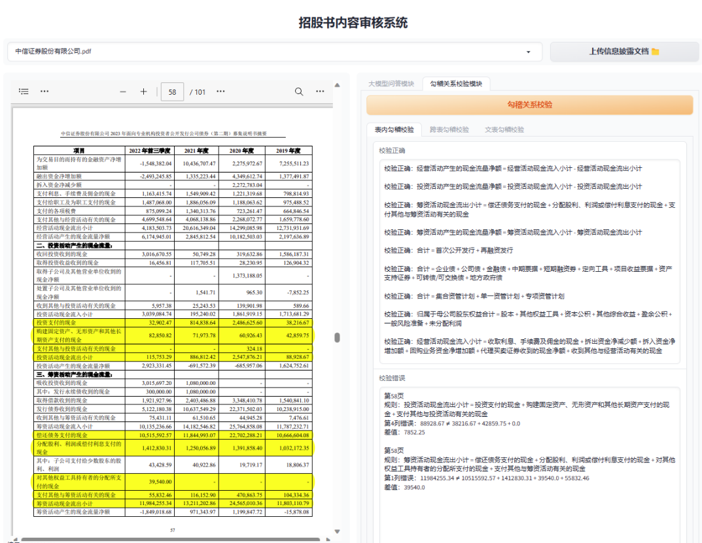

# ChatWithDoc
大语言模型ChatGLM-6B为基座，接入文档阅读功能进行实时问答，可上传txt/docx/pdf多种文件类型。

### 文档智能问答模块
- 支持较少页数的文档理解
- 支持问题的定位
- 支持多轮交互问答
- 支持txt / docx / pdf多种文件类型的输入
- 可在聊天过程中自由切换文档，切换后延续本篇文档的对话历史
- PDF文档问答中加入参考依据（不稳定）

### 财务勾稽关系审核模块



### 复现准备
- 开启show_pdf服务
- 开启大模型服务

### API部署

[//]: # (运行)

[//]: # (```)

[//]: # (python api.py)

[//]: # (```)

[//]: # ()
[//]: # (请求)

[//]: # (```)

[//]: # (file_path = "reference_file.pdf")

[//]: # (data = {"prompt": "这篇文章主要讲了什么？", "history": []})

[//]: # (multipart_data = {)

[//]: # (    'json': &#40;None, json.dumps&#40;data&#41;, 'application/json'&#41;,)

[//]: # (    'file': &#40;open&#40;file_path, 'rb'&#41;&#41;)

[//]: # (})

[//]: # (response = requests.post&#40;url, files=multipart_data&#41;)

[//]: # (```)

[//]: # ()
[//]: # (得到返回值)

[//]: # (```)

[//]: # ()
[//]: # (```)