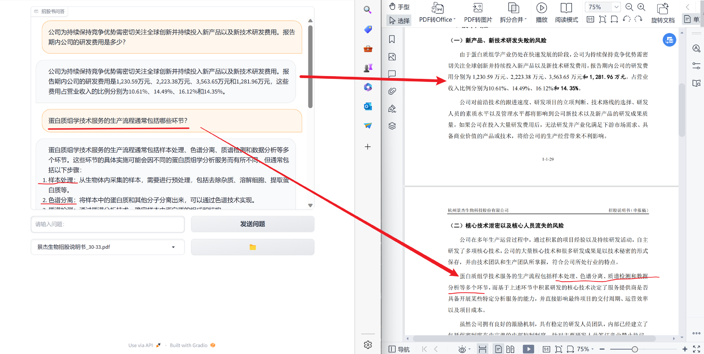

# ChatWithDoc
大语言模型ChatGLM-6B为基座，接入文档阅读功能进行实时问答，可上传txt/docx/pdf多种文件类型。
### 内容比对

### 显示参考依据

## 目前功能
- 支持较少页数的文档理解
- 支持问题的定位
- 支持多轮交互问答
- 支持txt / docx / pdf多种文件类型的输入
- 可在聊天过程中自由切换文档，切换后延续本篇文档的对话历史
- PDF文档问答中加入参考依据
