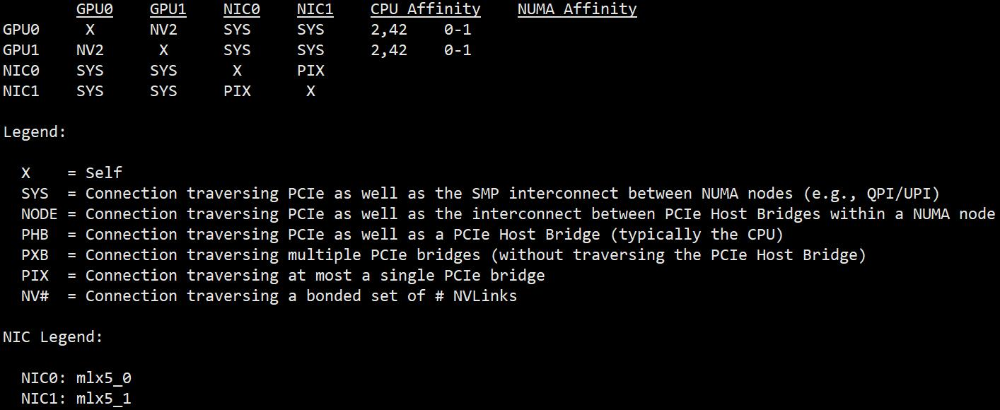
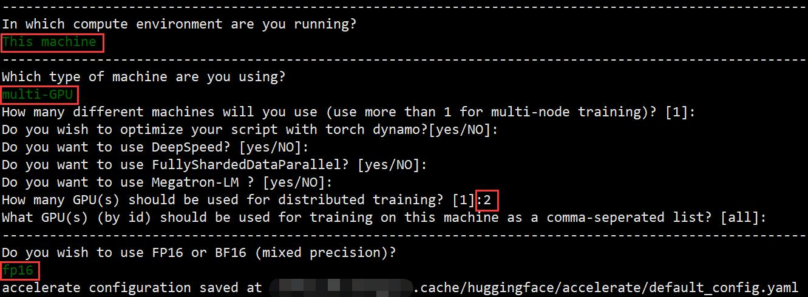
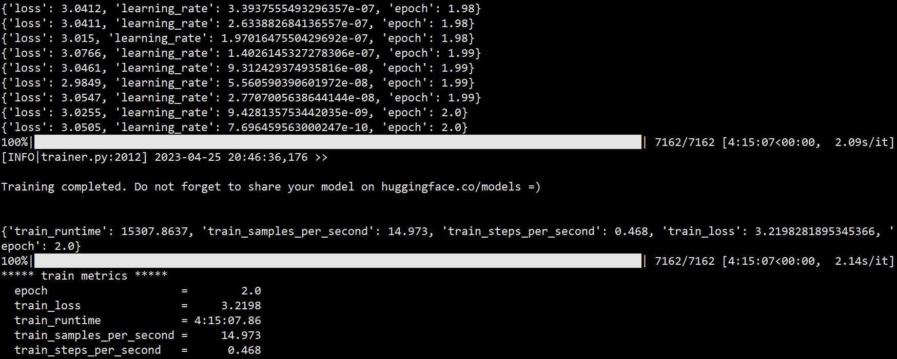
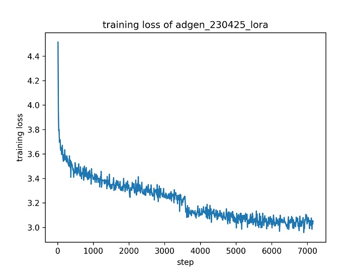

# 使用自定义数据集分布式训练的例子

## 一、环境配置

基本环境配置请参照[此案例](alter_self_cognition.md)。

为了进行分布式训练，我们需要准备一台配有多个 GPU 的主机。我们推荐在 NVLinks 桥接的多显卡主机上进行分布式训练，否则训练效率会大幅下降，可使用下述命令查询显卡之间的桥接方式。

```bash
nvidia-smi topo -m
```



为了进行分布式训练，运行以下命令配置分布式训练环境。

```bash
accelerate config
```

假设我们有一台配有 2 个 GPU 的机器，采用最基础的分布式训练配置，配置过程如下图所示，红色方框中代表比较重要的参数。



下面列出了配置好的 default_config.yaml 文件内容，其中 `num_processes` 行的值应当**与本机的 GPU 数量一致**。

```yaml
compute_environment: LOCAL_MACHINE
distributed_type: MULTI_GPU
downcast_bf16: 'no'
gpu_ids: all
machine_rank: 0
main_training_function: main
mixed_precision: fp16
num_machines: 1
num_processes: 2
rdzv_backend: static
same_network: true
tpu_env: []
tpu_use_cluster: false
tpu_use_sudo: false
use_cpu: false
```

## 二、数据集准备

在此案例中，我们使用 [ADGEN](https://aclanthology.org/D19-1321.pdf)（广告生成）数据集。该数据集的任务是根据一组商品标签生成广告文本，下面展示了数据集中的一个样本。

```json
{
    "content": "类型#裙*颜色#粉红色*图案#条纹*图案#印花*裙长#连衣裙",
    "summary": "这款粉红色条纹连衣裙精美大方，充满青春活力气息，十分唯美大气，尽显女性俏丽活泼感。且配以可爱亮眼的印花设计，更显女性甜美气息。"
}
```

该数据集可以从 [Google Drive](https://drive.google.com/file/d/13_vf0xRTQsyneRKdD1bZIr93vBGOczrk/view?usp=sharing) 或 [Tsinghua Cloud](https://cloud.tsinghua.edu.cn/f/b3f119a008264b1cabd1/?dl=1) 下载。

我们将下载好的数据集解压到 `data` 文件夹中，解压后的文件目录为：

```
data/
├── dataset_info.json
└── AdvertiseGen/
   ├── dev.json
   └── train.json
```

接下来，我们修改 `dataset_info.json`，增加以下两列内容，从而使训练框架能够识别自定义数据集。

```json
"adgen_train": {
    "file_name": "AdvertiseGen/train.json",
    "columns": {
        "prompt": "content",
        "query": "",
        "response": "summary",
        "history": ""
    }
},
"adgen_dev": {
    "file_name": "AdvertiseGen/dev.json",
    "columns": {
        "prompt": "content",
        "query": "",
        "response": "summary",
        "history": ""
    }
}
```

## 三、模型监督微调

运行下述命令进行分布式训练。我们使用 `adgen_train` 数据集，采用秩为 `32` 的 `lora` 微调方法，微调后的模型保存在 `adgen_lora` 文件夹中。为了保证模型微调成功，我们采用 0.001 的学习率，在数据集上训练 2 个 epoch。为了缓解模型拟合困难的问题，我们在每个输入样本的前面加一个统一的 prompt：`你现在是一名销售员，根据以下商品标签生成一段有吸引力的商品广告词。`

```bash
accelerate launch src/train_bash.py \
    --stage sft \
    --do_train \
    --dataset adgen_train \
    --finetuning_type lora \
    --output_dir adgen_lora \
    --overwrite_cache \
    --per_device_train_batch_size 2 \
    --gradient_accumulation_steps 2 \
    --lr_scheduler_type cosine \
    --logging_steps 10 \
    --save_steps 2000 \
    --learning_rate 1e-3 \
    --num_train_epochs 2.0 \
    --lora_rank 32 \
    --ddp_find_unused_parameters False \
    --source_prefix 你现在是一名销售员，根据以下商品标签生成一段有吸引力的商品广告词。 \
    --plot_loss \
    --fp16
```

框架运行日志如下图所示。



模型训练结束后，可以从保存文件夹 `adgen_lora` 中找到训练损失曲线图。



## 四、模型评估

我们使用 `adgen_dev` 数据集，使用单个 GPU 评估模型微调后的 BLEU 和 ROUGE 分数。

```bash
CUDA_VISIBLE_DEVICES=0 python src/train_bash.py \
    --stage sft \
    --do_eval \
    --dataset adgen_dev \
    --checkpoint_dir adgen_lora \
    --output_dir adgen_results \
    --per_device_eval_batch_size 4 \
    --source_prefix 你现在是一名销售员，根据以下商品标签生成一段有吸引力的商品广告词。 \
    --predict_with_generate
```

框架运行日志如下图所示。


评估结果如下表所述，其中 LoRA 方法取得了最高的 Rouge-1 分数和 Rouge-l 分数，另外 BLEU-4 分数和 Rouge-2 分数也基本与全量微调 `Finetune` 和 P-Tuning v2 持平。无论是哪种微调方法，其分数都显著超过了微调前模型 `Original` 的分数。

|         | Original |  Finetune  | P-Tuning v2 |    LoRA   |
| ------- | -------- | ---------- | ----------- | --------- |
| BLEU-4  | 4.56     | *8.01*     | ***8.10***  | 8.08      |
| Rouge-1 | 23.98    | *31.23*    | *31.12*     | **31.45** |
| Rouge-2 | 3.95     | ***7.36*** | *7.11*      | 7.28      |
| Rouge-l | 18.72    | *25.08*    | *24.97*     | **25.17** |
| Loss    | -        | ***3.00*** | *3.74*      | 3.22      |

注：*斜体* 数字代表文献 [1] 中汇报的实验结果。

## 五、模型测试

运行以下命令在单个 GPU 上测试模型效果，它会加载 `adgen_lora` 文件夹内保存的微调模型权重，并合并进原版 ChatGLM-6B 模型的参数权重中，同时启动流式交互窗口。

```bash
CUDA_VISIBLE_DEVICES=0 python src/cli_demo.py \
    --checkpoint_dir adgen_lora
```


## 参考文献

[1] [ChatGLM-6B 模型基于 P-Tuning v2 的微调](https://github.com/THUDM/ChatGLM-6B/blob/main/ptuning/README.md).
